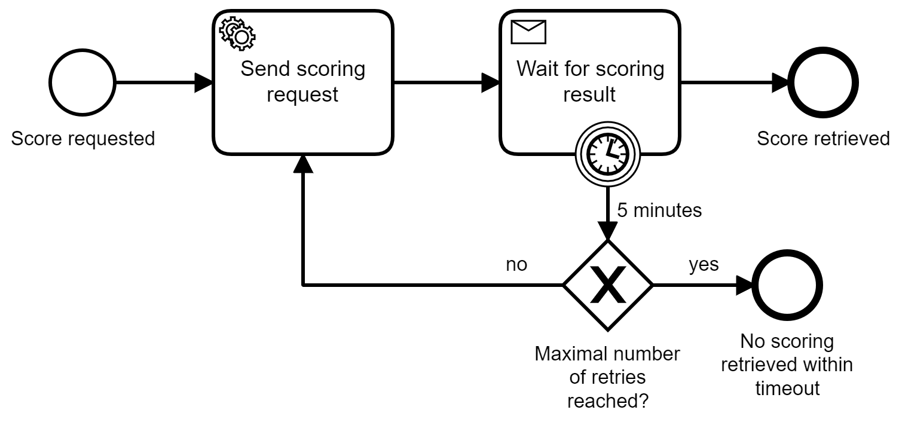

# Customer Onboarding Process - Extended Example


This following stack is used:

* Camunda Platform 8
* Java
* Spring Boot

# Simple Process

This extended process is based on a simpler example, that is meant to get started with process automation, workflow engines and BPMN:


The simple process model contains three tasks:

* A service task that executes Java Code to score customers (using the stateless Camunda DMN engine)
* A user task so that humans can approve customer orders (or not)
* A service task that executes glue code to call the REST API of a CRM system


# Extended Process


The extended process model adds some more tasks in the process:

* A DMN decision task that decides, if a customer order can be automatically processed or not (replacing the manual approval above)
* Scoring the customer will now be done via an external scoring service, that has an AMQP (messaging) API. The technical details around communication via AMQP are extracted in a seperate subprocess:




The process solution is a Maven project and contains:

* The process models as BPMN
* And embedded Camunda Form for user task handling
* Source code to provide the REST API for clients (using Spring Boot)
* Java code to do the customer scoring
* Glue code to implement the REST call to the CRM system
* Glue code for AMQP communication
* Fakes for CRM system and AMQP
* JUnit 5 test case


# How To Run

There is a walk through video available for the simple version of this process:


## Create Camunda 8 SaaS Cluster

* Login to https://camunda.io/ (you can create an account on the fly)
* Create a new cluster
* Create a new set of API client credentials
* Copy the client credentials into `src/main/resources/application.properties`

## Run RabbitMQ locally

```
docker run -p 15672:15672 -p 5672:5672 rabbitmq:3-management
```

* http://localhost:15672/#/queues/
* User: guest
* Password: guest

## Run Spring Boot Java Application

The application will deploy the process model during startup

`mvn package exec:java`


## Play

You can easily use the application by requesting a new customer onboarding posting a PUT REST request to 

`curl -X PUT http://localhost:8080/customer`

You can now see the process instance in Camunda Operate - linked via the Cloud Console.

You can adjust inputs by providing URl query parameters, e.g.

`curl -X PUT http://localhost:8080/customer?paymentType=invoice&monthlyPayment=40&customerRegionScore=25`

You can work on the user task using Camunda Tasklist, also linked via the Cloud Console.


# camunda-8-springboot-RabbitMQ
